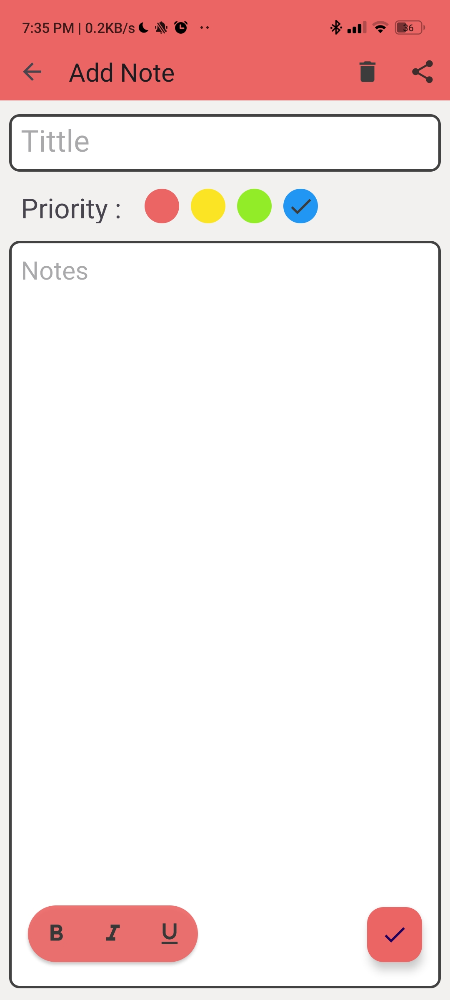
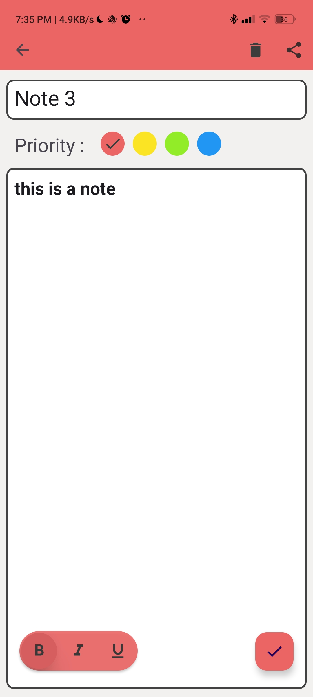
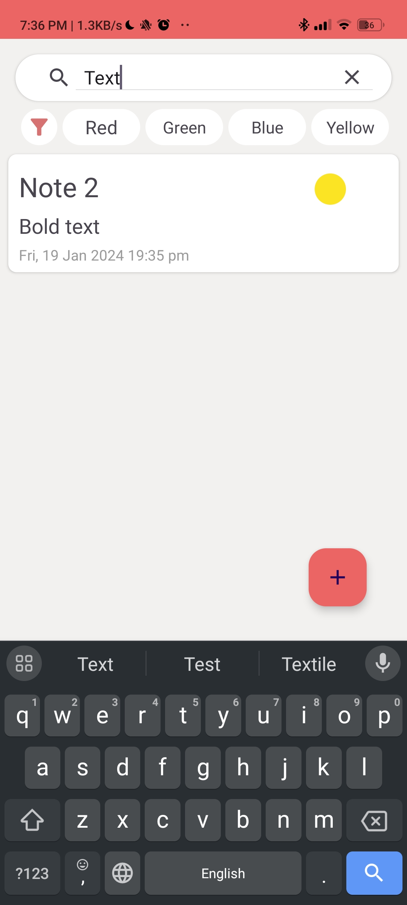
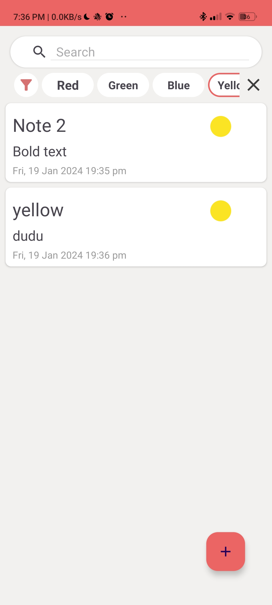
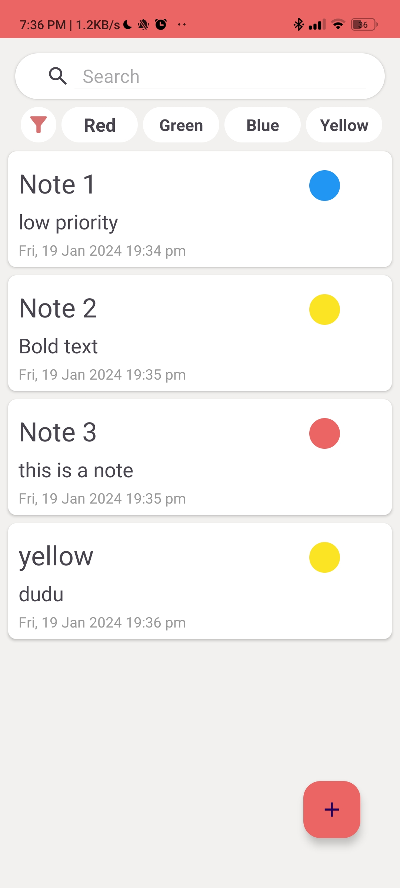
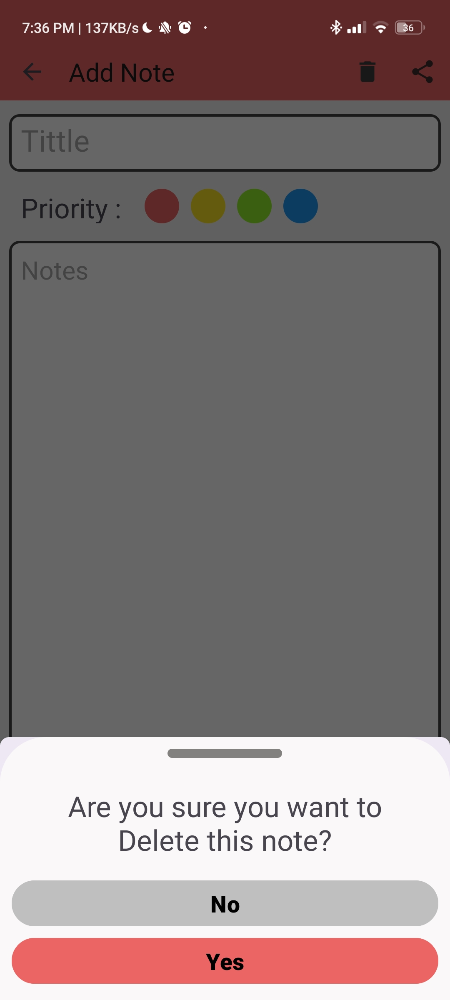
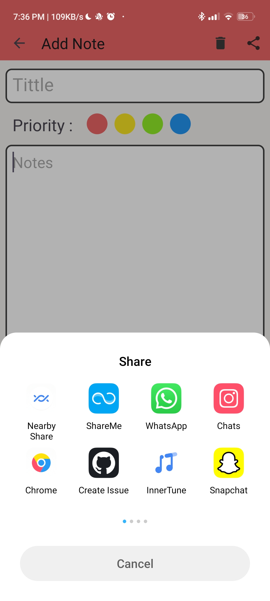
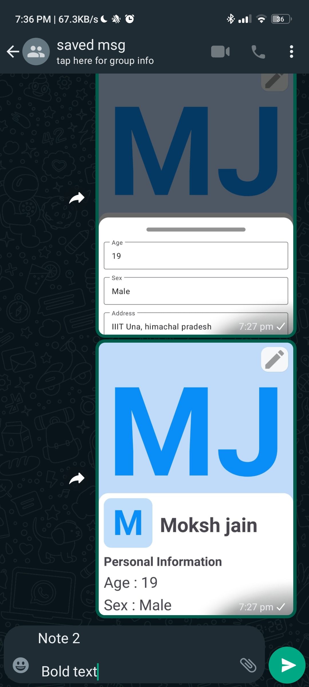

# Note++ App

Note++ is a feature-rich note-taking app developed as a learning project using Kotlin, XML, Android Studio, MVVM architecture, and Room Database. It provides a user-friendly interface for maintaining and organizing your notes effectively.

## Table of Contents

- [Features](#features)
- [Technologies Used](#technologies-used)
- [Screenshots](#screenshots)

## Features

- Create, edit, and delete notes.
- Assign priority colors to each note to indicate its importance.
- Filter notes by priority to focus on high-priority tasks.
- Search bar for quick and easy note retrieval.
- Formatting options for text, including bold and italic.
- Data persistence using Room Database.
- MVVM architecture for clean and organized code.

## Technology Used
- **Kotlin and Android Studio:**
  - Developed using Kotlin programming language in Android Studio.

- **Room:**
  - Room database for data storage.

- **Live Data**
  - To observe changes in data and do changes in UI accordingly

- **MVVM**
  - Used Model-View-ViewModel architecture 

## Screenshots

  
  
  
  

  
  
  
  

